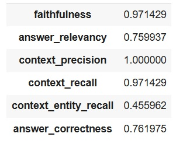

# RAG-Langchain-QA-on-Asthma
RAG Q&amp;A on Asthma - built with Langchain framework, with Guards rails and with RAG Evaluation. Submission as part of capstone project - PGD Data Science &amp; AI Program at SETU School

# 🫁 Asthma Disease QA System (RAG-based)

This repository contains an implementation of a **Question Answering (QA) system** using the **Retrieval-Augmented Generation (RAG)** framework. The project is focused on providing relevant and accurate answers to queries related to **Asthma Disease**.

> **Disclaimer:** This project is purely academic and is not intended for any commercial use.

---

## 🚀 Objective
The primary objective of this project is to **Build a QA RAG system** for Asthma-related information using reliable sources and state-of-the-art frameworks.

---

## 🛠️ Tech Stack

### **Backend**
- **Framework**: LangChain
- **Programming Language**: Python

### **Frontend**
- **Framework**: Streamlit

---

## 📚 Data Source
- The system retrieves data from the Cleveland Clinic's official website:  
  [Asthma Overview](https://my.clevelandclinic.org/health/diseases/6424-asthma)

---

## 🛠️ Components

### **Document Loader**
- **Tool**: SeleniumURLLoader

### **Text Splitter**
- **Method**: RecursiveCharacterTextSplitter

### **Retriever**
1. **Basic Retriever**: Cosine similarity-based retriever using **ChromaDB** in LangChain.  
2. **Relevance Reranker**: **BAAI/bge-reranker-large** for improved relevancy.

### **Language Model (LLM)**
- **Provider**: OpenAI  

### **Embeddings**
- **Tool**: OpenAIEmbeddings  

### **Vector Database**
- **Database**: ChromaDB  

---

## 📂 Files in the Repository

1. **Backend code with RAG Evaluation (`Evaluating RAG System on Asthma.ipynb`)**
   - Implements the **RAGAS** framework to measure:
     - **Precision**
     - **Recall**
     - **Correctness**
     - **Relevancy**

2. **Backend code & Streamlit UI App Integration (`app.py`)**
   - Combines the backend logic with the frontend.
   - Implements the 3 following **Guardrails**:
     - **PII Guardrails**: Custom checks for **email** and **phone numbers**.
     - **Other words related to other Diseases to avoid**: Custom Logic.

3. **Streamlit App Execution (`run_Streamlit_app.ipynb`)**
   - Python code to launch the **Streamlit** application.

---

## 📊 RAG Evaluation Results

Below is the evaluation result of the QA system based on the implemented **RAG Evaluation Framework**:  

** Correctness , Relevance , Context_Recall  , Context_Precision

---

---
